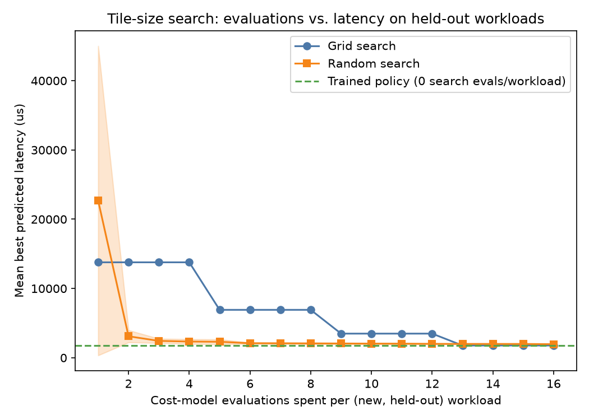

# Differentiable FlashAttention Tiling Autotuner

This project trains a small neural policy to predict good tile sizes for FlashAttention style
attention kernels by backpropagating through an analytical, non-differentiable, I/O complexity
cost model. The cost model is wrapped as a Tesseract using finite difference automatic
differentiation, composed with a JAX training loop through `tesseract-jax`, and compared against
grid search and random search baselines on held out workload shapes.

## Table of contents

1. [Problem statement](#problem-statement)
2. [Architecture](#architecture)
3. [Why this needed Tesseract](#why-this-needed-tesseract)
4. [Repository structure](#repository-structure)
5. [Setup](#setup)
6. [Running the project](#running-the-project)
7. [Results](#results)
8. [What the policy learned](#what-the-policy-learned)
9. [Limitations](#limitations)
10. [Phase 5: real hardware validation status](#phase-5-real-hardware-validation-status)
11. [Workload and hardware assumptions](#workload-and-hardware-assumptions)

## Problem statement

Modern attention kernels, following the FlashAttention line of work, tile the attention
computation into blocks so that the working set fits in fast on chip SRAM or shared memory,
avoiding materialization of the full N by N attention matrix in slow HBM. The choice of row
tile size (`Br`) and column tile size (`Bc`) has a large effect on kernel latency: larger tiles
reduce the number of HBM round trips but must still fit within the SRAM budget of the target
device.

In practice, the right tile size for a given workload shape (sequence length, head dimension,
number of heads, batch size) and a given accelerator (SRAM capacity, HBM bandwidth, compute
throughput) is found by grid search over a small set of candidate configurations, as in Triton's
autotuning decorators, or by hand tuning. Both approaches search from scratch for every new
workload shape and hardware target.

This project asks a different question: can a neural network be trained, with ordinary gradient
descent, to predict good tile sizes directly, by treating an analytical cost model as a
differentiable function and backpropagating through it into the network's weights? The central
obstacle is that the natural cost model for this problem is not smooth. Whether a tile fits in
SRAM is a hard yes or no branch, and that branch is exactly the kind of thing that plain
symbolic automatic differentiation, as implemented in JAX, PyTorch, or similar frameworks,
handles poorly. Tesseract's finite difference AD backend is used to sidestep that problem
entirely: it never needs to differentiate the branch symbolically, only to evaluate the cost
model at nearby points.

## Architecture

```
                     workload shape + hardware descriptor
                                    |
                                    v
                  +---------------------------------+
                  |   Tesseract B: tiling-policy     |
                  |   (JAX / Equinox MLP)            |
                  |   7 input features -> 3 hidden   |
                  |   layers (64, 64, 32) -> 2 out   |
                  |   sigmoid-bounded to [16, 128]   |
                  +---------------------------------+
                                    |
                              predicted Br, Bc
                                    |
                                    v
                  +---------------------------------+
                  |   Tesseract A: attention-cost-model  |
                  |   (C++ analytical roofline model)    |
                  |   HBM traffic + compute FLOPs        |
                  |   -> max(memory_time, compute_time)  |
                  |   gated by a hard SRAM feasibility   |
                  |   branch (non-smooth by design)      |
                  |   wrapped with finite-difference AD  |
                  +---------------------------------+
                                    |
                          predicted_latency_us,
                          sram_utilization
                                    |
                                    v
                     loss = latency + soft SRAM penalty
                                    |
                       jax.grad, through apply_tesseract's
                       custom_vjp (backed by Tesseract A's
                       finite-difference vector_jacobian_product),
                       then through the policy's own parameters
                       via ordinary JAX autodiff
                                    |
                                    v
                          Adam update to policy weights
```

Tesseract A (`tesseracts/attention-cost-model`) is a C++ implementation of an analytical
roofline model for FlashAttention style tiled attention, exposed as a Tesseract. It is wrapped
with `tesseract_core.runtime.experimental.finite_difference_jacobian`,
`finite_difference_jvp`, and `finite_difference_vjp`, rather than with hand-derived gradients or
a symbolic AD backend.

Tesseract B (`policy/model.py`, `policy/train.py`) is a small Equinox MLP that maps a
log-scaled, seven-dimensional workload and hardware descriptor to two continuous tile sizes,
`Br` and `Bc`. Its output layer is passed through a sigmoid and rescaled into a fixed valid
range, `[16, 128]`, so predictions are always physically valid tile sizes without a
non-differentiable clip operation.

The two Tesseracts are composed with `tesseract_jax.apply_tesseract`, which registers Tesseract
A's `apply`, `abstract_eval`, and `vector_jacobian_product` endpoints as a JAX primitive with a
custom VJP rule. This makes a call to Tesseract A fully traceable by `jax.jit`, `jax.grad`, and
`jax.vmap`, exactly like any other JAX operation, even though its own gradients are computed by
finite differences on the C++ side rather than by JAX's own symbolic autodiff. No custom
`custom_vjp` code was written by hand for this project; `tesseract-jax` provides the bridge
natively.

## Why this needed Tesseract

The SRAM feasibility branch in the cost model is the concrete non-smoothness this project is
built around. For a given tile size `(Br, Bc)` and head dimension `d`, the per-tile SRAM
footprint is

```
sram_tile_bytes = (2 * Br * d + 2 * Bc * d + Br * Bc) * dtype_bytes
```

reflecting a query tile, a key tile, a value tile, an output accumulator tile, and a scratch
score/probability tile of shape `(Br, Bc)`. If `sram_tile_bytes` exceeds the device's SRAM
budget, the tiling is illegal on real hardware, and the cost model applies a hard, discontinuous
50x latency penalty rather than a smooth ramp or a `relu` style soft penalty. This is a genuine
step discontinuity in `(Br, Bc)` space, verified directly: crossing the SRAM boundary
multiplies latency by exactly 50.0, not by some smoothly varying factor (see
`tesseracts/attention-cost-model/tests/test_cost_model.cpp`, which asserts this ratio to six
decimal places).

A step discontinuity of this kind has no useful gradient under symbolic automatic
differentiation. A framework such as plain JAX autodiff, differentiating through the branch as
written (for example a `jnp.where` on the feasibility condition), produces a gradient of exactly
zero on both sides of the boundary and an undefined value at the boundary itself. That gradient
is technically correct for the function as written, in the sense that the function truly is
locally flat away from the jump, but it is useless for training: it never tells the optimizer
which direction reduces the chance of falling into the infeasible region. Making the branch
differentiable in the usual way, for instance by replacing the hard multiplier with a smooth
sigmoid-based penalty, would remove the very feature this project is trying to demonstrate a
solution for, since a smooth cost model could simply use ordinary autodiff and would not need
Tesseract's finite difference backend at all.

Finite differences sidestep this cleanly because they never need to differentiate the branch
symbolically. `finite_difference_vjp` only evaluates `apply()` at a small number of perturbed
points near the current `(Br, Bc)` and estimates the local slope numerically. When the
finite-difference stencil straddles the SRAM boundary, this correctly reflects the large local
change in latency. When it does not, the reported gradient is legitimately zero, because the
function truly is flat there. This is an accurate, if locally limited, picture of the function's
actual behavior, and it required no hand-derived adjoint code and no relaxation of the
model's physical realism.

### A concrete gradient bug this approach caught

During development, an early version of the cost model computed the number of outer-loop
row-tile iterations as `ceil(seq_len / Br)`, matching how a real kernel would count loop
iterations. This introduced a second, unintended family of discontinuities: `ceil()` is
piecewise constant in `Br`, so its derivative is exactly zero almost everywhere, with all of its
gradient information concentrated at the measure-zero set of points where `seq_len` divides
`Br` exactly.

This was caught empirically, not by inspection. An initial correctness check happened to use
`Br = 64` and `seq_len = 2048`, an exact divisor, and reported a plausible nonzero gradient of
`d(latency)/d(Br) = -2097.152`. Later, when the same check was run against a realistic sampled
workload (`Br = 92.23`, `seq_len = 2993.98`, a non-exact ratio), the reported gradient was
`0.0` for both `Br` and `Bc`, even though the workload was clearly memory-bound (predicted
latency equaled the memory-bound term to five significant figures). Direct inspection of
`cost_model.jacobian()` at that point confirmed a zero gradient. The fix was to replace
`ceil(seq_len / Br)` with the continuous ratio `seq_len / Br`, which is also the approximation
FlashAttention's own asymptotic, big-O style I/O complexity analysis uses. After the fix, the
same workload produced a nonzero gradient (`d(latency)/d(Br) = -4.234`), and training proceeded
normally. This left the SRAM feasibility branch as the model's only deliberate discontinuity,
which is the situation the finite-difference AD argument above is actually about.

This episode is included here because it is a realistic illustration of a broader point: models
with hidden non-smoothness (integer rounding, ceilings, floors, min/max operators) are common in
systems and hardware cost models, and their gradients can silently vanish almost everywhere
without producing any error. Finite differences do not prevent this kind of bug, but they make
it directly observable by evaluating the function at nearby points, which is how it was found
here.

## Repository structure

```
tesseract-attn-autotune/
  tesseracts/
    attention-cost-model/          Tesseract A
      tesseract_api.py             Pydantic schemas, apply, jacobian, jvp, vjp, abstract_eval
      tesseract_config.yaml        Build config: compiles cost_model.cpp to a shared library
      tesseract_requirements.txt
      src/
        cost_model.h               C ABI declaration
        cost_model.cpp             The analytical cost model itself
      tests/
        test_cost_model.cpp        Standalone C++ test, no external test framework dependency
      lib/                         Build output (git-ignored), cost_model.so
  policy/                          Tesseract B and its training loop
    model.py                       TilingPolicy: the MLP
    sample_workloads.py            Workload distribution sampler and held-out evaluation set
    train.py                       Training loop, composes Tesseract A and B via tesseract-jax
  baselines/
    common.py                      Shared helpers for calling the cost model directly
    grid_search.py                 Grid search baseline over a Triton-style tile grid
    random_search.py               Random search baseline over the continuous tile range
    compare.py                     Evaluations-vs-latency comparison and plot
  validation/                      Phase 5 stretch goal, not attempted, see status below
  docs/
    evals_vs_latency.png           Committed copy of the headline results plot
  runs/                            Training outputs (git-ignored, regenerated by train.py)
  README.md
  .gitignore
```

## Setup

The project depends on `tesseract-core`, `tesseract-jax`, `jax`, `equinox`, `optax`, and
`numpy`, plus `matplotlib` for the comparison plot. A C++17 compiler (`g++` or equivalent) is
required to build the cost model's shared library, either locally for development or inside the
container image built from `tesseract_config.yaml`.

```bash
python -m venv .venv
source .venv/bin/activate        # or .venv\Scripts\activate on native Windows
pip install "tesseract-core[runtime]" tesseract-jax jax jaxlib equinox optax matplotlib numpy
```

`jax` is configured for 64-bit precision at the top of every entry point
(`jax.config.update("jax_enable_x64", True)`), since the cost model's schema uses `Float64`
throughout and `tesseract-jax` rejects 64-bit outputs when `jax_enable_x64` is left at its
default of `False`.

Everything in this repository was developed and verified on Windows without a running Docker
daemon, using WSL2 as a lightweight Linux environment for the C++ compiler and the Python
virtual environment. Two filesystem details are worth recording for anyone reproducing this
setup on WSL2: pip installs and Python virtual environments should live on the WSL2 native
filesystem (for example `~/venv`), not under `/mnt/c/...`, since installing onto the
Windows-mounted filesystem is roughly 30 to 50 times slower due to the 9P/DrvFs bridge; and
`/tmp` inside WSL2 is `tmpfs` and is cleared whenever the lightweight VM is idled and restarted,
so anything meant to persist across separate `wsl.exe` invocations should live under the user's
home directory instead.

## Running the project

### Building and testing the cost model

```bash
cd tesseracts/attention-cost-model
g++ -O2 -std=c++17 -o /tmp/test_cost_model tests/test_cost_model.cpp src/cost_model.cpp
/tmp/test_cost_model

mkdir -p lib
g++ -O3 -fPIC -shared -std=c++17 -o lib/cost_model.so src/cost_model.cpp
```

`tesseract_api.py` loads the shared library from `/tesseract/lib/cost_model.so` first (the path
it is baked into inside a built container image), falling back to `lib/cost_model.so` next to
itself for local development without a container build.

### Running the Tesseract locally, without Docker

For fast iteration, this project uses `Tesseract.from_tesseract_api(...)`, which runs a
Tesseract's Python API directly in process, without building or starting a Docker container:

```python
from tesseract_core import Tesseract

client = Tesseract.from_tesseract_api("tesseracts/attention-cost-model/tesseract_api.py")
client.apply({
    "Br": 64.0, "Bc": 64.0,
    "seq_len": 2048.0, "head_dim": 64.0, "num_heads": 16.0, "batch_size": 1.0,
    "sram_size_bytes": 167936.0, "hbm_bandwidth_gb_s": 2039.0,
    "compute_throughput_flops": 312e12, "dtype_bytes": 2.0,
})
```

For a containerized deployment, the equivalent call is `Tesseract.from_image("attention-cost-model")`
against an image built with `tesseract build tesseracts/attention-cost-model`. `policy/train.py`
isolates this choice in a single function, `make_cost_model_client()`, so switching from local
execution to a built container image requires changing one line, not the training loop itself.

### Training the policy

```bash
python -m policy.train --steps 3000 --batch-size 32 --lr 3e-3 --soft-penalty-weight 50.0
```

Each run creates a timestamped directory under `runs/` containing `loss_curve.csv` (loss and
aggregate metrics logged every `--log-every` steps), `eval_predictions.jsonl` (the policy's
`(Br, Bc)` predictions on a fixed, interpretable set of workload shapes, logged every
`--eval-every` steps, for tracking how predictions evolve during training), and
`policy_final.eqx` (the final policy weights, serialized with
`equinox.tree_serialise_leaves`).

### Running the baselines comparison

```bash
python -m baselines.compare --checkpoint runs/<run_id>/policy_final.eqx
```

This evaluates grid search, random search, and the trained policy on a fixed, seeded, 30-shape
held-out set (`policy.sample_workloads.held_out_workloads`, seed `20260816`, independent of
whatever seed a given training run used), writes `comparison_results.json`, and produces
`evals_vs_latency.png` if `matplotlib` is available.

## Results

### Cost model verification

`test_cost_model.cpp` verifies two things directly: that a tile which fits entirely in SRAM
incurs no penalty, and that a tile which does not fit incurs exactly the intended 50x
discontinuous penalty, not a partial or smoothed one. Both checks pass:

```
[PASS] feasible tile: sram_util=0.1098 latency_us=272.6298
[PASS] infeasible tile: sram_util=6.2439 penalty_ratio=50.0000
All tests passed.
```

### Training behavior

A 3000-step run (batch size 32, learning rate 3e-3, soft SRAM penalty weight 50.0, Adam
optimizer) was trained against the workload distribution described below. Two things happened,
both mechanistically explainable from the cost model's structure rather than being arbitrary
optimization artifacts:

First, `Br` saturated to `128`, the top of its valid range, within roughly 100 steps, for every
workload in the fixed evaluation set. This is the objectively correct behavior for this cost
model: predicted latency is monotonically non-increasing in `Br` (a larger row tile strictly
reduces the number of outer-loop passes over K and V), with no downside modeled other than SRAM
pressure, so pushing `Br` to its maximum is latency-optimal whenever it remains feasible. This
matches a well known real-world FlashAttention tuning heuristic: use the largest row tile that
fits.

Second, `Bc` converged to approximately `16.2`, near the bottom of its valid range, uniformly
across the fixed evaluation set, which spans sequence lengths from 1 to 8192 and head
dimensions from 64 to 128. This is a real, gradient-driven result, not an artifact: the SRAM
penalty term is the only source of gradient signal for `Bc` in this cost model, since `Bc` has
no effect on either the memory-bound or compute-bound latency terms on its own. Once `Br`
saturates near its maximum, the SRAM budget forces `Bc` down to remain feasible, and gradient
descent found the smallest safe value. See
[What the policy learned](#what-the-policy-learned) below for an important caveat about how
uniform this result is across workload shapes.

### Baseline comparison

Evaluated on 30 held-out workload shapes never seen during training:

| Method | Evaluations per new workload | Mean best latency (microseconds) |
|---|---|---|
| Grid search (4x4 grid, 16, 32, 64, 128) | 16 | 1770.41 |
| Random search (5 seeds, continuous [16, 128]) | 16 | 1959.73 +/- 85.63 |
| Trained policy | 0 | 1770.41 |



The trained policy matches grid search's best achievable latency exactly, using zero
cost-model evaluations at deployment time for a new workload, against 16 for grid search and 16
for random search (which itself needs roughly 13 evaluations before catching up to the same
mean, and never closes the gap with grid search's exact best point). This exact numerical tie
was checked rather than assumed: it holds because, in this cost model and this workload and
hardware distribution, the point `(Br = 128, Bc = 16)` is SRAM-feasible for every sampled
head dimension and hardware profile, including the tightest combination in the sample space
(head dimension 128 on the L4 profile, using about 78 kilobytes of a 100 kilobyte SRAM budget).
That point is therefore the joint global optimum across the whole distribution, and both the
exhaustive grid (which includes that exact corner) and the trained policy (which converged to
essentially that corner) find it. The cost paid by the policy to find this optimum was incurred
once, during training (roughly 480,000 cost-model evaluations across the full 3000-step run,
amortized over every workload sampled during training), rather than being paid again for every
new workload at deployment time, which is the actual value proposition of an amortized, learned
optimizer over an unamortized, per-instance search.

## What the policy learned

The clearest, most reliable thing the policy learned is that `Br` should be pushed to the
largest value the SRAM budget allows, essentially independent of sequence length, head
dimension, or hardware target, because larger row tiles are latency-optimal in every regime this
cost model represents. This is the single most important lever in the model and the policy
found it quickly and consistently.

The `Bc` result deserves a more careful reading than "the policy learned smaller `Bc` for longer
sequences," which was the original hypothesis going into this project. What was actually
observed is that `Bc` converges to a small, close to constant value across essentially the
entire evaluation set, largely independent of sequence length. This is a real and mechanistically
explainable finding, not a training failure: because `Bc` has zero direct effect on predicted
latency in this cost model, contributing to latency only through the binary SRAM feasibility
check, gradient descent has no incentive to differentiate `Bc` further than "small enough to be
safe." Any two feasible values of `Bc` are treated identically by the loss function, so once the
network finds a value that is safe across the batch, there is no gradient pressure to grow it
back up for individual workloads where a larger value would be equally valid. The resulting
policy is correctly conservative, not incorrectly flat.

This is a genuine limitation of the cost model, not of the training procedure, and it is a
useful negative result: an interpretable, per-workload trend in `Bc` would require the cost
model to give `Bc` a direct, continuous effect on latency, independent of the SRAM branch, for
example by modeling reduced compute utilization from very small tiles (loop and kernel launch
overhead that is not fully amortized when tiles are small), which real FlashAttention kernels do
exhibit but which this cost model, as built, deliberately keeps out of scope in the interest of
simplicity and to isolate the SRAM branch as the model's sole source of non-smoothness.

## Limitations

This cost model is a simplified analytical approximation of real GPU memory and compute
behavior, not a validated predictor of real kernel latency. Specifically:

- The compute term uses a fixed peak FLOP/s figure for each hardware profile and does not model
  achieved compute efficiency, which in practice depends on tile shape, occupancy, and other
  scheduling effects not represented here.
- The HBM traffic term counts full re-reads of K and V once per outer-loop row tile and does not
  model cache effects, memory coalescing, or the L2 cache present on real accelerators, all of
  which materially affect real measured bandwidth.
- `Bc` has no effect on either latency term outside of the SRAM feasibility check, which is a
  modeling simplification, not a fact about real hardware, and is the direct cause of the flat
  `Bc` result described above.
- The SRAM budget used per hardware profile is a conservative, hand-set approximation of a
  per-streaming-multiprocessor shared memory or L1 budget, not a value read from real device
  specifications or validated against a real kernel's actual SRAM usage, which also includes
  compiler-managed register allocation and other overheads not modeled here.
- No real GPU kernel was run at any point in this project. All latency numbers reported above
  are the cost model's own predictions, evaluated against itself; no correlation with real
  measured hardware latency has been established. See the next section for what would be needed
  to close that gap.

## Phase 5: real hardware validation status

Phase 5, training a small real transformer with tile sizes chosen by the trained policy and
comparing real measured throughput against a fixed baseline tiling, was treated as a stretch
goal per the original project brief and was not attempted in this submission.

GPU access assumption: this project was developed and verified entirely on a Windows machine
with WSL2, without a running Docker daemon and without a local CUDA-capable GPU exercised during
development (`jax` reported falling back to CPU in every run in this environment). No cloud or
local GPU access was available or assumed for this submission.

Fallback plan, as specified in the original project brief: Phases 1 through 4 are a complete,
submittable entry on their own, and this README documents them as such. If GPU access becomes
available, the recommended path for Phase 5 is not to write a custom Triton or CUDA kernel with
configurable tile sizes from scratch, which is a substantial undertaking on its own, but to use
an existing tile-size-configurable attention implementation, for example a FlashAttention
implementation that exposes block-size arguments, and vary only those exposed knobs using the
trained policy's recommendations for a small transformer's shape (for instance, a 4 to 6 layer
GPT trained on TinyShakespeare or WikiText-2), reporting real measured tokens per second or
per-step wall-clock time against a fixed, untuned baseline tiling.

## Workload and hardware assumptions

The training and evaluation workload distribution is grounded in real transformer model
families rather than arbitrary ranges, as follows:

- Head dimension is sampled from `{64, 96, 128}`. GPT-2 style models commonly use head
  dimension 64 (for example, a 12-head, 768-hidden model). Llama-2 and Llama-3 models across
  the 7 billion to 70 billion parameter range commonly use head dimension 128. Some mid-size
  models, such as GPT-NeoX-20B, use head dimension 96.
- Number of heads is sampled from `{8, 16, 32}`, spanning smaller configurations (8), medium
  configurations comparable to GPT-2 XL or Llama-2 13B class models (16), and larger
  configurations comparable to Llama-2 7B and 70B or GPT-NeoX-20B (32).
- Two sequence length and batch size regimes are sampled to reflect real LLM serving patterns.
  A decode-like regime samples sequence length uniformly from 1 to 32 tokens with a large batch
  size (64 to 512), reflecting many concurrent single-token decode steps. A prefill-like regime
  samples sequence length log-uniformly from 512 to 8192 tokens with a small batch size (1 to
  8), reflecting one or a few long prompts being prefilled or trained on. Training batches mix
  these two regimes, with roughly 40 percent decode-like samples by default
  (`--decode-frac 0.4`).
- Hardware descriptors are sampled uniformly from three profiles intended to span a realistic
  range of real accelerators: an NVIDIA A100 80GB profile (164 kilobytes of usable SRAM per
  streaming multiprocessor, 2039 gigabytes per second of HBM bandwidth, 312 teraFLOP/s bf16
  compute throughput), an NVIDIA H100 80GB SXM profile (228 kilobytes SRAM, 3350 gigabytes per
  second, 989 teraFLOP/s), and an NVIDIA L4 24GB profile (100 kilobytes SRAM, 760 gigabytes
  per second, 165 teraFLOP/s), the last of which is deliberately the tightest on SRAM and is
  used as the fixed hardware profile for the interpretability evaluation set in
  `policy.sample_workloads.fixed_eval_workloads`, precisely because it is the profile where the
  SRAM constraint is most likely to bind.
- The valid tile size range for both the policy's output and the grid search baseline's grid is
  `[16, 128]`, matching the range of tile sizes typically seen in Triton FlashAttention
  autotuning configurations.
